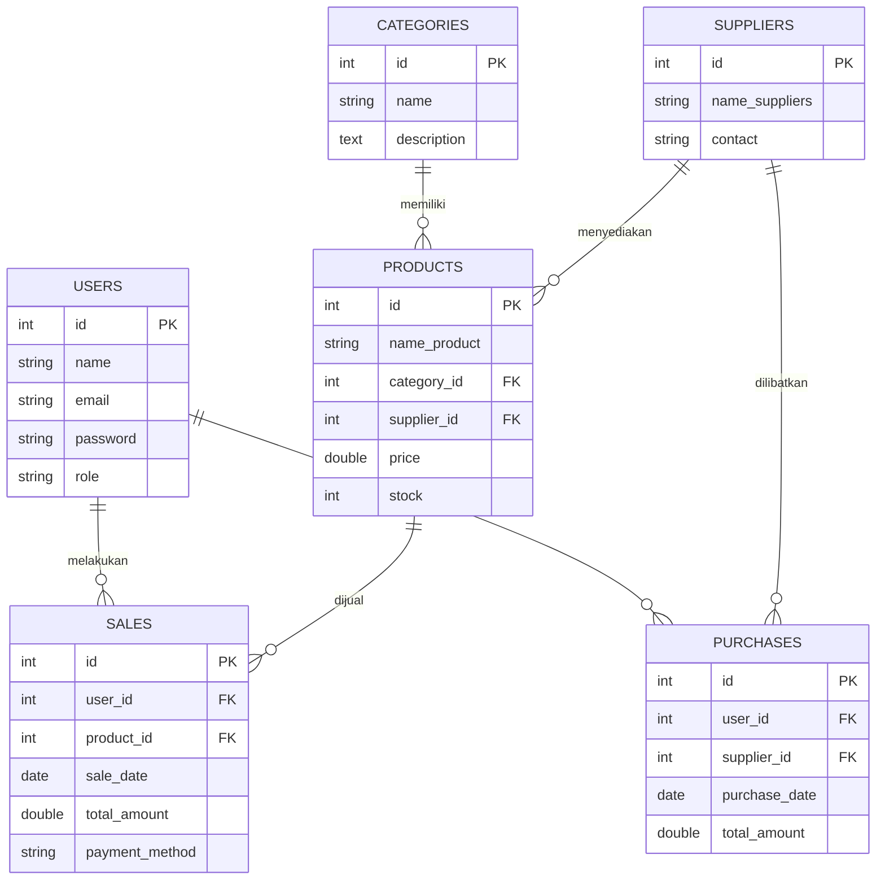
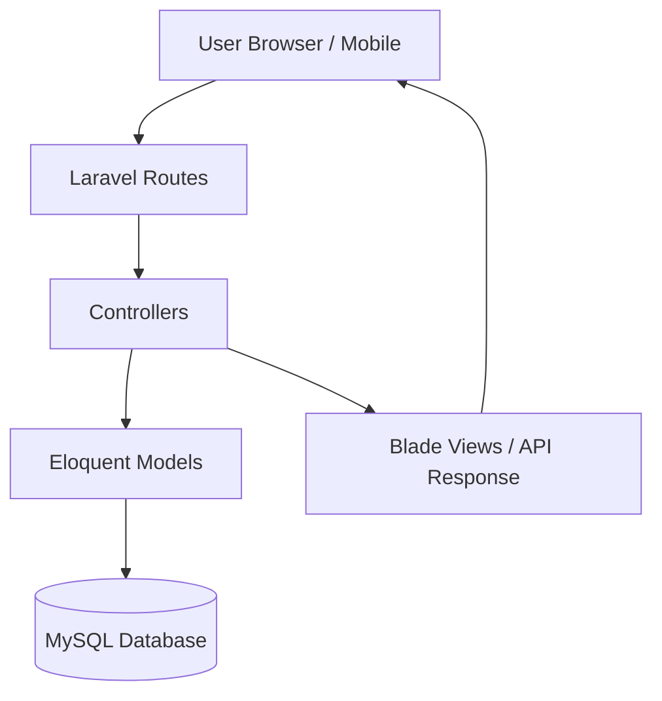

# 🚀 GOTHRU — Aplikasi Penjualan

<p align="center">
  
  
  
  
  
</p>

---

## 👥 PKL — GOTHRU

Anggota:

1. Eqi Perdana
2. Azhar Aulia
3. Tegar Katresna

---


## ✨ Ringkasan

**GOTHRU — Aplikasi Penjualan** adalah sistem manajemen penjualan berbasis *Laravel* yang dibuat untuk memudahkan pengelolaan **produk, kategori, supplier, penjualan, dan pembelian**. Sistem ini menerapkan **role-based access control** (Admin & Karyawan) sehingga hak akses dapat dibedakan.

<p align="center">
  
</p>

<p align="center">
  <!-- Ganti demo.gif dengan gif demo aplikasi kamu di folder docs/screenshots/ -->
  
</p>

---

## 🚀 Fitur Utama

* 🔐 Autentikasi & Role (Admin & Karyawan)
* 📦 CRUD Produk, Kategori, Supplier
* 🧾 Transaksi Penjualan & Pembelian
* 📊 Dashboard Statistik (Chart.js)
* 📁 Laporan dan Export data (opsional)
* 🎨 UI responsif dengan Bootstrap 5

---

## 🛠️ Teknologi

| Bagian   | Teknologi                                              |
| -------- | ------------------------------------------------------ |
| Backend  | Laravel 12, Eloquent ORM                               |
| Frontend | Blade, Bootstrap 5, Chart.js                           |
| Database | MySQL / MariaDB                                        |
| Tools    | Composer, NPM, Carbon, Breeze Auth,Viscode, dan github |
                        
---

## 📊 Database (ERD)



---

## 🏛️ Arsitektur Sistem



---

## ⚡ Instalasi Singkat

```bash
# Clone
git clone https://github.com/username/gothru-aplikasi-penjualan.git
cd gothru-aplikasi-penjualan

# Install dependency
composer install
npm install && npm run dev

# Konfigurasi .env
cp .env.example .env
php artisan key:generate
# Edit .env -> sesuaikan DB_*

# Migrasi & seeder
php artisan migrate --seed

# Jalankan server
php artisan serve
```

Buka: `http://127.0.0.1:8000`

---

## 👥 Role & Hak Akses

| Role         | Hak Akses                                                                                    |
| ------------ | -------------------------------------------------------------------------------------------- |
| **Admin**    | CRUD Produk, Kategori, Supplier, User, Penjualan, Pembelian, Stocklog, Product Harga Histori |
| **Karyawan** | Input Penjualan & Pembelian, Lihat Data Produk                                               |

---


## 🤝 Kontribusi

repo ini di colaborasi supaya mempermudah kelompok untuk mengakses reponya dan bisa menambahkan atau mengedit repo nya juga

---

## 📄 Lisensi

MIT License © 2025 — GOTHRU

---

## 📬 Kontak

Dibuat oleh tim **GOTHRU** (Eqi, Azhar, Tegar). Untuk pertanyaan atau demo, buka Issues atau hubungi via GitHub.

---
