# 🚀 GOTHRU — Aplikasi Penjualan

<p align="center">
  
  
  
  
  
</p>

---

## 👥 Tim — GOTHRU

Anggota:

1. Eqi Perdana
2. Azhar Aulia
3. Tegar Katresna

---

<p align="center">
  
</p>

<p align="center">
  
</p>

---


## ✨ Ringkasan

**GOTHRU — Aplikasi Penjualan** adalah sistem manajemen penjualan berbasis *Laravel* yang dibuat untuk memudahkan pengelolaan **produk, kategori, supplier, penjualan, dan pembelian**. Sistem ini menerapkan **role-based access control** (Admin & Karyawan) sehingga hak akses dapat dibedakan.

<p align="center">
  
</p>

<p align="center">
  <!-- Ganti demo.gif dengan gif demo aplikasi kamu di folder docs/screenshots/ -->
  
</p>

---

## 🚀 Fitur Utama

* 🔐 Autentikasi & Role (Admin & Karyawan)
* 📦 CRUD Produk, Kategori, Supplier
* 🧾 Transaksi Penjualan & Pembelian
* 📊 Dashboard Statistik (Chart.js)
* 📁 Laporan dan Export data (opsional)
* 🎨 UI responsif dengan Bootstrap 5

---

## 🛠️ Teknologi

| Bagian   | Teknologi                          |
| -------- | ---------------------------------- |
| Backend  | Laravel 10, Eloquent ORM           |
| Frontend | Blade, Bootstrap 5, Chart.js       |
| Database | MySQL / MariaDB                    |
| Tools    | Composer, NPM, Carbon, Breeze Auth |

---

## 🖼️ Foto & GIF (petunjuk)

Untuk menambahkan foto atau GIF ke README:

1. Simpan file gambar/gif di folder repo `docs/screenshots/` atau `docs/images/`.

   * Contoh:

     * `docs/screenshots/demo.gif` (rekaman demo)
     * `docs/screenshots/dashboard.png` (screenshot dashboard)
     * `docs/screenshots/login.gif` (login flow sebagai GIF)
     * `docs/images/team.jpg` (foto tim)
     * `docs/images/logo.png` (logo aplikasi)

2. Panggil gambar di README dengan markdown:

```markdown

```

> Tip: kalau GIF berukuran besar, pertimbangkan gunakan Git LFS atau unggah ke layanan hosting gambar (Imgur / Cloud) lalu pakai URL-nya.

---

## 📊 Database (ERD)


---

## 🏛️ Arsitektur Sistem

```mermaid
flowchart TD
    A[User Browser / Mobile] --> B[Laravel Routes]
    B --> C[Controllers]
    C --> D[Eloquent Models]
    D --> E[(MySQL Database)]
    C --> F[Blade Views / API Response]
    F --> A
```



---

## ⚡ Instalasi Singkat

```bash
# Clone
git clone https://github.com/username/gothru-aplikasi-penjualan.git
cd gothru-aplikasi-penjualan

# Install dependency
composer install
npm install && npm run dev

# Konfigurasi .env
cp .env.example .env
php artisan key:generate
# Edit .env -> sesuaikan DB_*

# Migrasi & seeder
php artisan migrate --seed

# Jalankan server
php artisan serve
```

Buka: `http://127.0.0.1:8000`

---

## 👥 Role & Hak Akses

| Role         | Hak Akses                                                            |
| ------------ | -------------------------------------------------------------------- |
| **Admin**    | CRUD Produk, Kategori, Supplier, User, Penjualan, Pembelian, Laporan |
| **Karyawan** | Input Penjualan & Pembelian, Lihat Data Produk                       |

---

## 📸 Contoh Penempatan Foto di README

Berikut contoh markup yang rapi untuk menampilkan beberapa gambar secara responsif:

```html
<p align="center">
  
</p>

<p align="center">
  
</p>

<div align="center">
  
  
</div>

<p align="center">
  
</p>
```

---

## 🤝 Kontribusi

Fork repository → buat branch fitur → pull request. Sertakan deskripsi jelas & screenshot jika ada perubahan UI.

---

## 📄 Lisensi

MIT License © 2025 — GOTHRU

---

## 📬 Kontak

Dibuat oleh tim **GOTHRU** (Eqi, Azhar, Tegar). Untuk pertanyaan atau demo, buka Issues atau hubungi via GitHub.

---

*Catatan: Ganti contoh path gambar (`docs/screenshots/*` dan `docs/images/*`) dengan file yang nyata di repo kamu. Jika butuh, saya bisa bantu buat GIF demo atau pilihan layout foto yang lebih estetis.*
